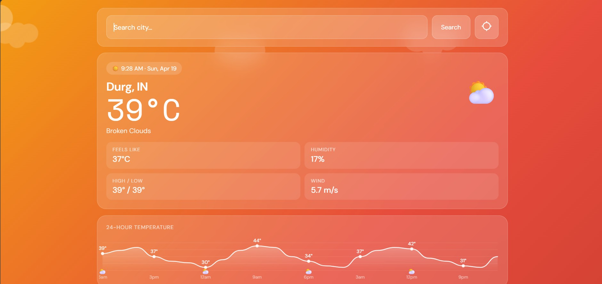
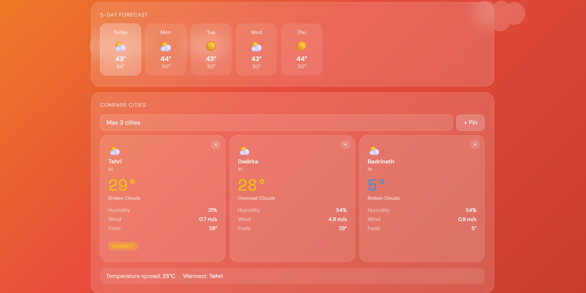
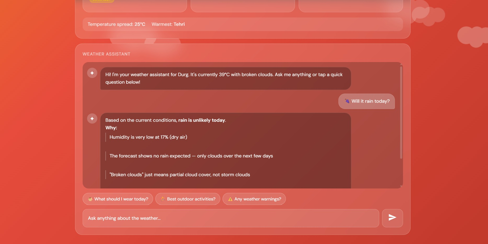
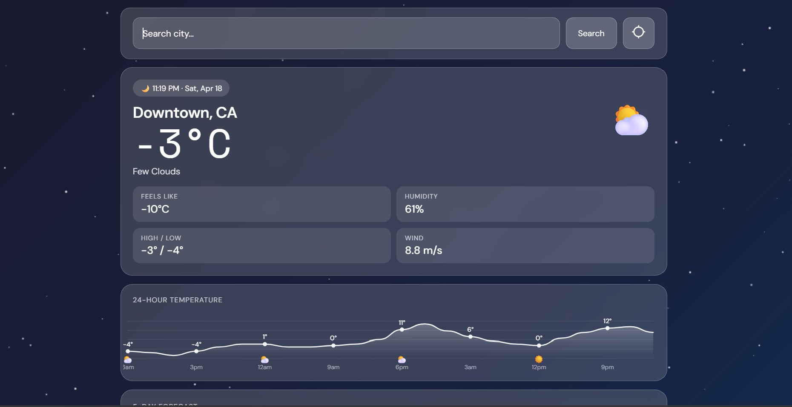
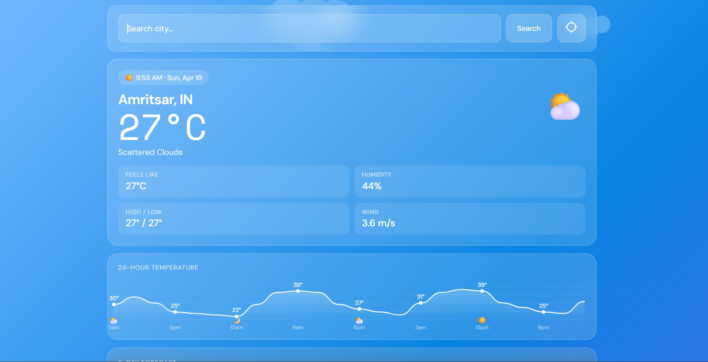

# 🌦️ AI Weather App

A modern weather app with an **AI assistant** that provides real-time forecasts, insights, and smart recommendations.

---

## 🚀 Features

* 🌍 Real-time weather (temp, humidity, wind)
* 📅 5-day forecast (daily high/low + conditions)
* 📊 24-hour weather chart (temperature & rain trends)
* 🌆 Compare weather of up to 3 cities
* 🤖 AI assistant
* 🎨 Clean chat-based UI with smooth animations

---

## 🛠️ Tech Stack

* **Frontend:** React.js, JavaScript, CSS, MUI Icons
* **Backend:** Node.js, Express.js
* **APIs:** Open Weather API , Kilo AI API

---

